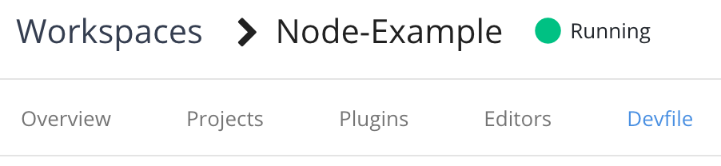

# Portable Development Environments using Devfiles

## Introduction
In this lab we will explore how we can create portable development environments using CodeReady Workspaces and the concept of devfiles.

The devfiles offer developers a starting point for building applications by offering containerized runtime environments, starting applications with additional functionality built in, and tools to aid in development. 

For the lab today we will be using CodeReady Workspaces which is a browser based code editor that runs on OpenShift.

## Prereqs

- An IBM Cloud Account
- A GitHub account

## Using devfiles in CodeRedy Workspaces

### Install CodeReady Workspaces

1. Navigate to [IBM Cloud](https://cloud.ibm.com)
1. Log in to your account
1. Click on the menu button at the top left of the page, hover over **OpenShift** and click on **Clusters**.

    

1. There should only be one cluster that shows up for you. Click on it.

1. Then, click on the blue **OpenShift Web Console** button near the top right of the page.

    

1. The first step is to create a project for us to work in. Click on **Projects** under the **Home** section in the left navigation bar.

    

1. Then, click on **Create Project**

1. In the new dialog window, enter the name **devfile-project** and click on **Create**.

1. Now we need to navigate to the Operator Hub to install CodeReady Workspaces. Find the **Operators** section on the left navigation bar and click on **Operator Hub**.

    

    The Operator Hub has a large variety of software available as operators with easy installation and lifecycle management.

1. In the *filter by keyword* textbox, enter **code** to filter the operators and show the CodeReady Workspaces operator.

    

1. Click on the **Red Hat CodeReady Workspaces** tile and then click on the blue **Install** button.

1. Ensure that under the **Installation Mode** you have the *A specific namespace on the cluster* option selected and **devfile-project** is selected in the dropdown. Then click **Subscribe**.

    

1. You should now be taken to the **Installed Operators** section. Wait until the *CodeReady Workspaces* operator is installed and then click on it.

1. From the CodeReady Workspaces operator details page, click on the **Create Instance** link.


1. On the next page, leave everything as it is and click on the **Create** button at the bottom. This will begin the process of creating the necessary resources to bring up CodeReady Workspaces.

    This process will take about 2-5 minutes to complete.

### Creating a DevFile in CodeReady Workspaces

1. To launch CodeReady Workspaces, click on **Networking** on the left navigation bar and select **Routes**.

1. Look for the route named **codeready** and click on the link under the *location* column.


1. You will then be taken to a log in page for CodeReady Workspaces. Since we are not using OpenShift's authentication, we will need to create a new log in. Click on the **Register** button at the botom of the dialog box.


1. Enter the information in the registration form to create your account for CodeReady Workspaces. Feel free to use made up information as the only things that really matters are **Username**, **Password**, and **Confirm Password** fields. This information is only used for this instance of CodeReady Workspaces and will stay on the cluster. When done click on **Register**

    You will then be taken to a page full of different workspaces. These workspaces contain tools and a development environment needed to start developing in those specific languages. These environment definitions are contained in what's called a **Devfile**. Let's create our own devfile and workspace.

1. Click on the **Custom Workspace** tab at the top of the page.

1. For *Workspace Name* enter **Node-Example**.

1. For the *URL of devfile* box in the *Devfile* section enter **https://raw.githubusercontent.com/odrodrig/nodejs-ex/master/devfile.yaml** and then click on **Load devfile**.

1. Click on **Create and Open** at the bottom of the page. The button might be hidden so you might need to scroll down to see it.

    The workspace will take a few minutes to create so let's get our own copy of the code that we will be using for the rest of the lab.

1. In a new browser window, navigate to **https://github.com/odrodrig/nodejs-ex** and click on the **Fork** button at the top right of the page.

1. Once you are taken to your own repo, look for a green button that says **Code** on the right side of the page and click on it.

    

1. Ensure the box is titled *Clone with HTTPS* and copy the URL listed.
1. Go back to your browser tab with CodeReady Workspaces. Hopefully the workspace creation is finished by now, if not, just give it a few more minutes.
    When done, you should see be inside the code editor.

1. Go to View in the toolbar and select **Find Command...**
1. In the new dialog that appears enter **git** and select **Git: clone**.
1. When asked for a *Repository URL* enter the URL that you copied earlier from your git repository then press enter.
1. Expand the project explorer by clicking on the icon that looks like 2 pieces of paper on the left toolbar. You should see the project that you cloned from GitHub.


1. Click on the folder of the project that you cloned and select the **devfile.yaml** file. This is the file we used to create this workspace.

    Let's break down this file to understand what it defined for us in the workshop.

    - apiVersion - The version of the devfile API we are using. This will not usually change.
    - metadata - Contains metadata for the workspace. *Name* is a required property.
    - components - These are the additions to your workspace such as plugins and tools to assist with development or application components such as kubernetes objects or docker containers.
        - In our imported devfile, we have one component which is the containerized runtime environment for our node application.

    Another type of component that can be added is a *che plugin*, These plugins give us additional functionality in the CodeReady Workspaces IDE.
        - In our workspace let's add a typescript plugin that will give us some code completion, error checking, and more.

1. Click on **View** in the top toolbar and select **Plugins**. This will open up a new pane on the left side with a list of all plugins available to be installed.

1. In the search bar, enter **typescript** and click on the **Install** button for the result that appears.


1. Then, click on the green message that appears that says *Click here to apply changes*, then click on **Restart** in the new dialog box that comes up.

    You might be asked if you are sure you want to leave the page, click on **Leave Page**.

    The workspace will be rebuilt with the new plugin installed.

1. Optionally, if you want to test out the plugin you can open up the **server.js** file, type in jiberish, and see the plugin highlight the mistake. As you can see in the screenshot below, the typescript plugin (*ts*) caught the syntax error. Be sure to delete any jiberish you do type out.


1. CodeReady Workspaces will maintain a devfile of the workspace's current configuration, including the plugin we just installed. To access this devfile, click on the yellow button at the top left of the page to expand the left menu. Then click on **Workspaces**.

1. Click on your workspace and then click on the **Devfile** tab.



1. Copy the entire devfile contents.

1. Return to the workspace by clicking on the **Node-Example** workspace on the left menu.


1. Then replace the contents of **devfile.yaml** with the contents you copied earlier by highlighting all the code and pasting in the devfile. You should see a new entry under **components**; the typescript che plugin.

    Another property that you can add to devfiles is the **projects** array. This will bring in those project files into the environment. For our lab we will specify a git repo in this section so that it will be cloned in automatically when the environment is created.

1. In **devfile.yaml** add the following code block to the bottom:

```yaml
projects:
  - name: nodejs-ex
    source:
      location: 'https://github.com/odrodrig/nodejs-ex.git'
      type: git
      branch: master
```

Your new devfile should look like this:

```yaml
metadata:
  name: Node-Example
components:
  - mountSources: true
    endpoints:
      - name: nodejs
        port: 3000
    memoryLimit: 1024Mi
    type: dockerimage
    alias: runtime
    image: 'quay.io/eclipse/che-nodejs10-ubi:nightly'
  - id: che-incubator/typescript/latest
    type: chePlugin
apiVersion: 1.0.0
projects:
  - name: nodejs-ex
    source:
      location: 'https://github.com/odrodrig/nodejs-ex.git'
      type: git
      branch: master
```

1. Then, edit the **location** property of the project in the devfile to be the git repository url that you copied earlier. You can get this URL from the tab that has GitHub open.

1. Next, let's add the **commands** array which will allow us to run commands to build and run the application within the runtime container. Add the following to the and of the devfile.

```yaml
commands:
  - name: devBuild
    actions:
      - workdir: '${CHE_PROJECTS_ROOT}/nodejs-ex/'
        type: exec
        command: npm install
        component: runtime
  - name: devRun
    actions:
      - workdir: '${CHE_PROJECTS_ROOT}/nodejs-ex/'
        type: exec
        command: nodemon app.js
        component: runtime
```

Your devfile should now look like this:

```yaml
metadata:
  name: Node-Example
projects:
  - name: nodejs-ex
    source:
      location: 'https://github.com/odrodrig/nodejs-ex.git'
      type: git
      branch: master
components:
  - mountSources: true
    endpoints:
      - name: nodejs
        port: 3000
    memoryLimit: 1024Mi
    type: dockerimage
    alias: runtime
    image: 'quay.io/eclipse/che-nodejs10-ubi:nightly'
  - id: che-incubator/typescript/latest
    type: chePlugin
apiVersion: 1.0.0
commands:
  - name: devBuild
    actions:
      - workdir: '${CHE_PROJECTS_ROOT}/nodejs-ex/'
        type: exec
        command: npm install
        component: runtime
  - name: devRun
    actions:
      - workdir: '${CHE_PROJECTS_ROOT}/nodejs-ex/'
        type: exec
        command: nodemon app.js
        component: runtime
```

1. Now we need to rebuild the workspace to include the commands we just added. Copy the contents of your new devfile.yaml then click on the yellow menu button at the top left and click on the **Workspaces** button again.

1. Next, click on your workspace and then click on the **devfile** tab. 

1. Replace the existing devfile by highlighting the code and pasting in the code that you copied from your new devfile.


1. Then, click on the green **Apply** button at the bottom right. This will rebuild your workspace and take a few minutes.

1. Return to the workspace by clicking on the **Node-Example** workspace on the left menu.


1. Now we can run our application using the commands that we just added. Click on the **Terminal** button in the toolbar and select **Run task...**. This is where you can run commands specified in the devfile.

1. In the new dialog that appears select **devBuild** and then select *Continue without scanning the task output*. This will run *npm install* in the runtime container to download the necessary dependencies for our application.

    You should notice a new tab appear at the bottom of the page with the build output.

1. Next, click on **Terminal** again, select **Run task...**, and this time select **devRun**. You can again click on *Continue without scanning the tsk output* when asked. This will run the application in the runtime container and allow us to test out it's functionality.

1. After running the application, you will get a pop up saying that *A process is now listening on port 3000....*. Click on the blue button to open the link to view your running application.

    A new section should open up on the right side of the page which contains a preview of your application. By looking in the address bar you may also notice that this is actually running as a container on OpenShift. Any changes you make to the code will be automatically applied to the running application giving you an easy way to test changes out. Let's test this out.

1. In your project explorer on the left side of the page, click on the **nodejs-ex** folder to expand it and select **server.js**.

1. Then, go to line 55. You should see the following code there:

    ```javascript
      res.send('Hello from Node.js Starter Application with odo!');
    ```

    Go ahead and customize the message to say what ever you'd like or simply add something extra at the end of the string in between the single quotes. For example:

    ```javascript
      res.send('Hello from Node.js Starter Application with CodeReady Workspaces!');
    ```

    You should notice some output in the *devRun* tab at the bottom of the page. This means that your application has detected changes and is rebuilding.

1. Click on the refresh button in the application preview on the right side of the page to view your latest changes.

    

    

1. Now let's push our changes back to GitHub so that we can share this workspace with other developers. Click on the *Source Control: git* button on the left toolbar. It should look like the following:


1. You will be shown a list of changes we made since the project was cloned from github. Hover over the word *Changes* and you should see a **+** appear. Click on it to stage all of our changes for a commit.

1. Then click on the text box labeled *Message* and enter **Updated devfile**. Then click on the check mark right above the textbox to commit your changes.


1. Next, click on the 3-button menu in the Source Control panel and select **push**.


1. You will then get a prompt asking for your username. Enter your GitHub username and then press enter.

    Then, you will be asked for your password. Enter your GitHub password and press enter.

With that done your new devfile has been pushed to GitHub and can be shared with other developers using CodeReady Workspaces.


## EXTRA CREDIT: Local deployment of devfile with odo

In this section we will explore how we can take the devfile we created earlier and use it to develop our application locally.

This section requires a local terminal environment, Docker, and [the odo cli](https://docs.openshift.com/container-platform/4.2/cli_reference/openshift_developer_cli/installing-odo.html).

<!-- 1. First we need to install the OpenShift developer cli called **odo**. You can install this  -->

<!-- 1. If you haven't already, get access to a terminal environment by following [these instructions].(https://github.com/IBM/ddc-cloud-native-security-labs/blob/master/workshop/lab-03/skillsNetwork.md). -->

1. Then, we need to clone the repository locally. Run the following command in that terminal environment:

```bash
git clone https://github.com/odrodrig/nodejs-ex.git
cd nodejs-ex
```

<!-- 1. Next, we need to run the installation script for odo

```bash
chmod 755 ./install_odo.sh
bash install_odo.sh
``` -->

1. In order to use devfiels with odo, we need to enable experimental features. Run the following:

    ```bash
    odo preference set experimental true
    ```

1. Next let's target docker as our deploytment target

    ```bash
    odo preference set pushtarget docker
    ```

1. Then, we will create a url which will allow us to expose our application to traffic. This is essentially creating a way for us to communicate with the application once we deploy it.

    ```bash
    odo url create --port 3000
    ```

1. Now we can deploy the application to docker using **odo push**.

    ```bash
    odo push
    ```

1. Next, we need to find out what port our application was exposed on. Although we specified that the application listens on port 3000, that is not the port that will be exposed on the host machine. To find the correct port, run the following command:

    ```bash
    docker ps
    ```

    You should see something like this:

    ```bash
    CONTAINER ID        IMAGE                                      COMMAND                  CREATED             STATUS              PORTS                                 NAMES
    1623815845bf        quay.io/eclipse/che-nodejs10-ubi:nightly   "/opt/odo/bin/superv…"   27 seconds ago      Up 26 seconds       8080/tcp, 127.0.0.1:51750->3000/tcp   naughty_wu
    ```

1. Look for the port binding under the *PORTS* column. It should be something like `8080/tcp, 127.0.0.1:51750->3000/tcp`. the `51750` is the port that the application is exposed on.

1. Navigate to the application by opening your browser and going to **localhost:\<port\>** where port is the external port retrieved in the previous step. For example, my application is exposed at **localhost:51750**

1. You can see the same application that we started with in CodeReady Workspaces is deployed locally in Docker.

1. You can also run **odo watch** and have code changes propagated to the running container automatically.

## Conclusion